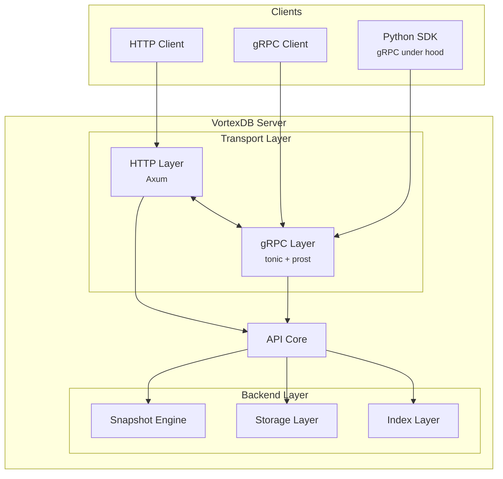

# Architecture

VortexDB is a high-performance vector database built in Rust, designed with modularity and flexibility at its core. This page explains how the components work together.

## High-Level Overview



## Crate Structure

VortexDB is organized as a Rust workspace with the following crates:

| Crate | Purpose |
|-------|---------|
| `server` | Main entry point, configuration, server startup |
| `api` | Core database logic and error handling |
| `grpc` | Protocol Buffers definitions and gRPC service |
| `http` | REST API handlers using Axum |
| `index` | Vector indexing algorithms (Flat, KD-Tree, HNSW) |
| `storage` | Persistence backends (InMemory, RocksDB) |
| `snapshot` | Point-in-time backup and restore |
| `defs` | Shared type definitions |
| `tui` | Terminal user interface |

## Transport Layers

VortexDB exposes two APIs that share the same underlying database:

### gRPC API

The **gRPC layer** is the primary high-performance interface:

- **Protocol**: HTTP/2 with Protocol Buffers
- **Port**: 50051 (default)
- **Authentication**: API key via `authorization` header
- **Use cases**: Production workloads, SDKs, high-throughput scenarios

```protobuf
service VectorDB {
  rpc InsertVector(InsertVectorRequest) returns (PointID);
  rpc DeletePoint(PointID) returns (google.protobuf.Empty);
  rpc GetPoint(PointID) returns (Point);
  rpc SearchPoints(SearchRequest) returns (SearchResponse);
}
```

### HTTP API

The **HTTP layer** provides a RESTful interface:

- **Protocol**: HTTP/1.1 with JSON
- **Port**: 3000 (default)
- **Authentication**: None (designed for internal/trusted networks)
- **Use cases**: Quick testing, curl commands, prototyping

| Method | Endpoint | Description |
|--------|----------|-------------|
| `GET` | `/` | Root endpoint |
| `GET` | `/health` | Health check |
| `POST` | `/points` | Insert a point |
| `GET` | `/points/:id` | Get a point by ID |
| `DELETE` | `/points/:id` | Delete a point |
| `POST` | `/points/search` | Search for similar vectors |

### When to Use Which?

<Tabs>
  <Tab title="Use gRPC when...">
    - Building production applications
    - Using the Python SDK (it uses gRPC)
    - Need authentication
    - Processing high volumes of requests
    - Want strongly-typed client libraries
  </Tab>
  <Tab title="Use HTTP when...">
    - Quick prototyping with curl
    - Integrating with systems that don't support gRPC
    - Debugging and testing
    - Building browser-based tools
  </Tab>
</Tabs>

## Storage Layer

The storage layer persists vectors and their payloads using a trait-based design:

```rust
pub trait StorageEngine: Send + Sync {
    fn insert(&self, vector: DenseVector, payload: Payload) -> Result<PointId>;
    fn get(&self, point_id: PointId) -> Result<Option<Point>>;
    fn delete(&self, point_id: PointId) -> Result<bool>;
    fn checkpoint_at(&self, path: &Path) -> Result<StorageCheckpoint>;
    fn restore_checkpoint(&mut self, checkpoint: &StorageCheckpoint) -> Result<()>;
}
```

### Available Backends

| Backend | Description | Use Case |
|---------|-------------|----------|
| **InMemory** | Stores data in RAM | Development, testing, ephemeral workloads |
| **RocksDB** | LSM-tree persistent storage | Production deployments |

Set the backend via the `STORAGE_TYPE` environment variable:
```bash
STORAGE_TYPE=rocksdb  # or 'inmemory'
```

## Index Layer

The index layer provides fast similarity search. See [Indexers](/concepts/indexers) for details on choosing the right index.

```rust
pub trait VectorIndex: Send + Sync {
    fn insert(&mut self, vector: IndexedVector) -> Result<()>;
    fn delete(&mut self, point_id: PointId) -> Result<bool>;
    fn search(&self, query: DenseVector, similarity: Similarity, k: usize) -> Result<Vec<PointId>>;
}
```

## Data Flow

Here's what happens when you insert a vector:

<Steps>
  <Step title="Client Request">
    Client sends insert request via gRPC or HTTP
  </Step>
  <Step title="Validation">
    Server validates vector dimensions match configuration
  </Step>
  <Step title="Storage Write">
    Vector and payload are persisted to the storage backend
  </Step>
  <Step title="Index Update">
    Vector is added to the index for fast searching
  </Step>
  <Step title="Response">
    Server returns the generated point ID to client
  </Step>
</Steps>

## Configuration

VortexDB is configured via environment variables:

| Variable | Required | Default | Description |
|----------|----------|---------|-------------|
| `GRPC_ROOT_PASSWORD` | Yes | - | Authentication password for gRPC |
| `DIMENSION` | Yes | - | Vector dimensionality |
| `DATA_PATH` | No | `/data` | Path for persistent storage |
| `HTTP_HOST` | No | `0.0.0.0` | HTTP server bind address |
| `HTTP_PORT` | No | `3000` | HTTP server port |
| `GRPC_HOST` | No | `0.0.0.0` | gRPC server bind address |
| `GRPC_PORT` | No | `50051` | gRPC server port |
| `STORAGE_TYPE` | No | `inmemory` | Storage backend |
| `INDEX_TYPE` | No | `flat` | Index algorithm |
| `LOGGING` | No | `true` | Enable logging |
| `DISABLE_HTTP` | No | `false` | Run gRPC only |

## Thread Safety

VortexDB is designed for concurrent access:

- The **storage layer** uses `Arc` for thread-safe reference counting
- The **index layer** uses `RwLock` for concurrent reads with exclusive writes
- Both gRPC and HTTP handlers are fully async using Tokio

## Next Steps

<CardGroup cols={2}>
  <Card title="Indexers" icon="magnifying-glass" href="/concepts/indexers">
    Learn about index algorithms and when to use each
  </Card>
  <Card title="Snapshots" icon="camera" href="/concepts/snapshots">
    Understand backup and restore mechanisms
  </Card>
</CardGroup>
